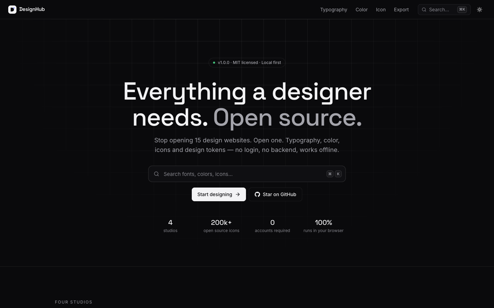
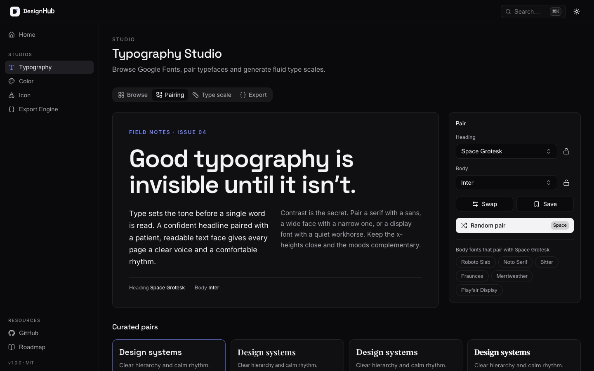
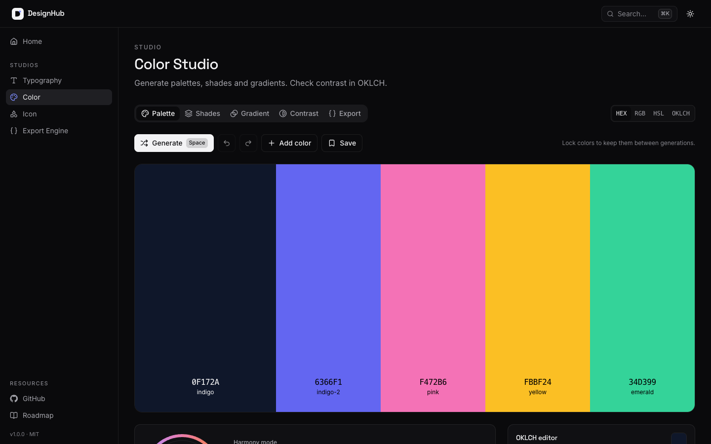
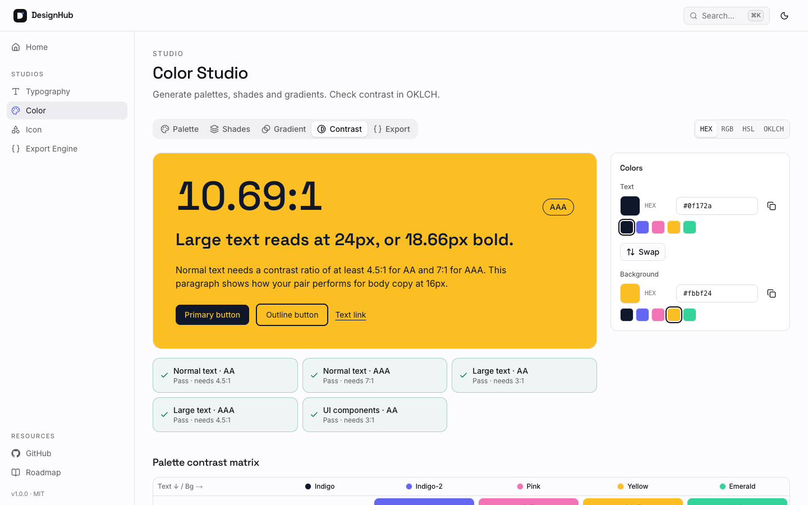
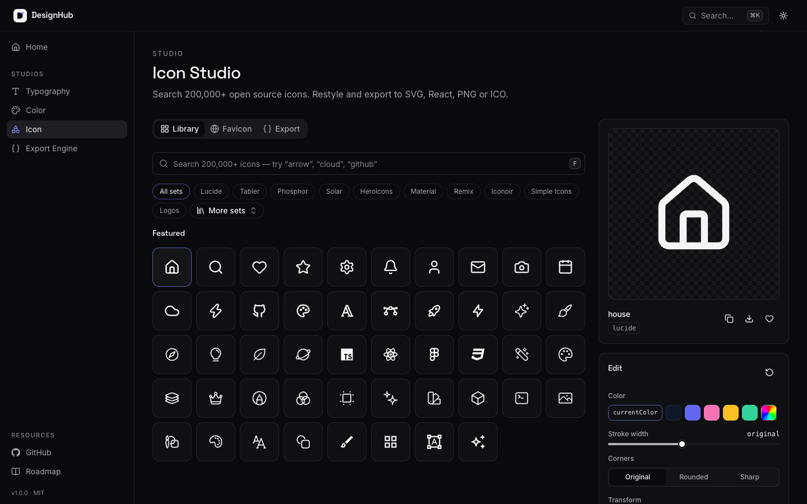
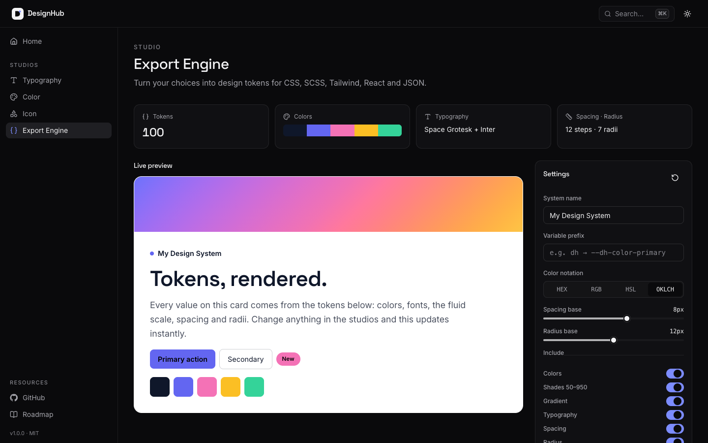

<div align="center">


# DesignHub

**Stop opening 15 design websites. Open one.**

An open-source, local-first design & brand identity toolkit.
Typography, color, icons, backgrounds, effects, SVG, accessibility and design tokens — in one fast, keyboard-first workspace.

[Features](#features) · [Screenshots](#screenshots) · [Quick start](#quick-start) · [Roadmap](ROADMAP.md) · [Contributing](CONTRIBUTING.md)


</div>

---

## Why DesignHub?

A typical design session bounces between a font site, a palette generator, a contrast checker, an icon library, a background generator, a CSS effects playground, an SVG optimizer, an accessibility checker and a tokens converter. DesignHub puts all of it in one tab — and everything you make stays **on your device**.

- **Open source** — MIT licensed. Fork it, extend it, self-host it.
- **Local first** — favorites, palettes and settings persist in IndexedDB.
- **No login, no backend** — there is no server to send your work to.
- **Offline first** — color, type scale and export tools work without a connection; icons you have opened are cached for offline use.
- **Keyboard first** — `⌘K` for everything, `G` + letter to jump, `Space` to shuffle.
- **Production ready** — exports drop straight into CSS, SCSS, Tailwind (v3 and v4) and React.
- **Dark & light** — tuned themes that follow your system preference.

## Features

| Studio                | What it does                                                       | Exports                                                       |
| --------------------- | ------------------------------------------------------------------ | ------------------------------------------------------------- |
| **Typography Studio** | Google Fonts, variable axes, pairing, fluid type scale, OpenType   | CSS · Tailwind · SCSS · React · JSON tokens                   |
| **Color Studio**      | Palettes, harmonies, OKLCH, shades 50–950, gradients, WCAG         | CSS variables · Tailwind · JSON tokens · SVG gradient         |
| **Icon Studio**       | 200,000+ Iconify icons, restyling, favicons                        | SVG · React · CSS · PNG · ICO · favicon ZIP                   |
| **Background Studio** | Waves, blobs, mesh, aurora, noise, dots, grid, isometric           | SVG · PNG (1× / 2×) · CSS background                          |
| **Effects Lab**       | Glass, neumorphism, layered shadows, glow, gradient borders, grain | CSS · Tailwind classes · Tailwind `@utility` · SCSS · React   |
| **SVG Playground**    | Inspect, edit, optimize, convert, build sprites                    | Optimized SVG · JSX · React · React Native · sprite           |
| **Accessibility Lab** | WCAG contrast, color vision, readability, dyslexia, touch targets  | JSON audit report                                             |
| **Export Engine**     | One token model from every studio, plus assets                     | CSS · SCSS · Tailwind v4 / v3 · React theme · DTCG JSON · PDF |

### Typography Studio

- Google Fonts browser with 500 families, lazy-loaded previews that download only the glyphs they show
- Search, category filters, variable-only filter, sort by popularity / name / weight count
- Favorites and recent fonts
- Variable font playground: a slider for every axis (`wght`, `wdth`, `opsz`, `SOFT`, `WONK`, …) plus axis animation
- Weight and italic controls, letter spacing and line height
- Font pairing engine: curated pairs, rule-based suggestions, random pairing with locks, saved pairs
- Fluid type scale generator (separate mobile and desktop ratios) and a standalone `clamp()` generator
- Responsive preview at any viewport width
- OpenType controls: ligatures, small caps, lining / oldstyle / tabular figures, fractions, slashed zero, stylistic sets
- Local font inspector powered by OpenType.js (your file never leaves the browser)
- Exports: **CSS, Tailwind, SCSS, React, JSON tokens** and a Google Fonts embed

### Color Studio

- Palette generator with locked colors, undo / redo and saved palettes
- Harmony modes: analogous, complementary, split-complementary, triadic, tetradic, monochromatic
- OKLCH editor with live gradient sliders and **HEX / RGB / HSL / OKLCH** inputs (accepts any CSS color)
- sRGB and Display P3 gamut indicators
- Shade generator (**50–950**) computed in OKLCH, with hue shift
- Gradient builder: **linear, radial and conic**, draggable stops, OKLCH / OKLab / sRGB interpolation
- **WCAG** contrast checker with AA / AAA results, one-click fixes and a full palette contrast matrix
- Color blindness preview (protanopia, deuteranopia, tritanopia, achromatopsia)
- Exports: **CSS variables, Tailwind, JSON tokens, SVG gradient**

### Icon Studio

- Search 200,000+ open-source icons from 200+ Iconify collections
- Browse by collection, with license information
- Restyle: color, stroke width, rounded or sharp corners, rotate, flip, padding and background shapes
- Exports: **SVG, React (TSX), CSS data URI, PNG (16–1024 px) and ICO**
- Favicon generator: `favicon.ico`, `icon.svg`, Apple touch icon, PWA icons, `site.webmanifest` and HTML — zipped

### Export Engine

- One shared design-token model built live from every studio
- Generates **CSS variables, SCSS, Tailwind v4 `@theme`, Tailwind v3 config, React theme and JSON tokens** (W3C DTCG format)
- Semantic roles (primary, accent, foreground, background) inferred from your palette
- 8px spacing scale and 12px radius scale, both configurable
- Live preview UI kit, one-click copy, **Download JSON**, all formats as `.zip`, preview PNG and a PDF style guide
- Effect tokens (`--shadow-card`, `--shadow-glow`, `--blur-glass`) that follow Tailwind v4's theme namespaces
- **Assets**: background CSS + SVG, the full `effects.css` bundle, the optimized SVG and the accessibility report — always in sync with their studios

### Background Studio

- Eight procedural generators: **waves, blobs, mesh gradients, aurora, noise texture, dot patterns, grid patterns and isometric patterns**
- Seeded and deterministic — every seed reproduces exactly; **Randomize** (or `Space`) rolls a new one
- Shared controls for colors (or one click to use your Color Studio palette), density, scale, rotation and canvas size (desktop, Full HD, Open Graph, square, story)
- Blobs are smoothed with **Paper.js** (loaded on demand); noise uses SVG `feTurbulence`
- Rotation always covers the canvas edge to edge
- Exports: **SVG, PNG (1× and 2×) and CSS** — native CSS gradients for mesh, dots and grid; an inline SVG data URI for the rest

### Effects Lab

- **Glassmorphism** — blur, saturation, tint, opacity, border and shadow
- **Neumorphism** — depth, softness, intensity, light direction, radius; flat, concave, convex and pressed shapes
- **Shadow generator** — unlimited layers (x, y, blur, spread, color, opacity, inset) plus presets, including eased "smooth" shadows
- **Glow generator** — color, radius and intensity with optional text glow
- **Border generator** — gradient borders with no extra markup, and animated conic borders via `@property` (respects reduced motion)
- **Grain overlay** — fractal-noise texture with scale, frequency, opacity and blend mode
- Live preview on gradient, photo, light or dark backdrops
- Exports: **CSS, Tailwind arbitrary-property classes, Tailwind v4 `@utility`, SCSS mixins and React style objects**

### SVG Playground

- Upload, **drag & drop** or paste SVG; edit the source live
- Safe preview (rendered as an image, so embedded scripts never run) with zoom, fit and backdrops
- **viewBox editor** and intrinsic size controls, including "make responsive"
- **Path & group inspector**: keyboard-navigable element tree, selection highlight, path command breakdown (via svg-path-parser), bounds
- **Fill & stroke editor** for the selected element or every shape at once
- **Optimization engine** (built on svgson): metadata and editor-data removal, id cleanup, group collapsing, precision control, shortest absolute/relative path data, color shortening, style-to-attribute conversion — scripts and event handlers are always stripped
- **Minify** or **pretty print**, with byte savings
- Converters: **SVG → JSX, SVG → React component (TypeScript), SVG → React Native** (react-native-svg)
- **Sprite generator**: combine many SVGs into one `<symbol>` sprite with namespaced ids and usage snippets
- **Download optimized SVG**

### Accessibility Lab

- **WCAG checker** — body text, links, button labels and non-text UI (1.4.11) with AA / AAA verdicts and one-click fixes
- **Vision simulation** — protanopia, deuteranopia, tritanopia, grayscale and low vision, one at a time or side by side, plus _perceived_ contrast under each
- **Readability** — font size validator, line-height analysis (WCAG 1.4.12), characters-per-line measured in the real font, Flesch reading score and grade
- **Dyslexia preview** — letter and word spacing, a dyslexia-friendly preset and a letter-scrambling reading simulation
- **Touch targets** — 44px validator (2.5.5 AAA) and the 24px + spacing check (2.5.8 AA), drawn to scale
- Everything updates instantly and exports as a **JSON report**

## Screenshots

| Home                               | Typography                                            |
| ---------------------------------- | ----------------------------------------------------- |
|  |  |

| Colors                                       | Contrast (light theme)                                 |
| -------------------------------------------- | ------------------------------------------------------ |
|  |  |

| Icons                                      | Export Engine                                 |
| ------------------------------------------ | --------------------------------------------- |
|  |  |

## Quick start

Requirements: **Node.js 20.9+** and **pnpm 11** (the version is pinned in `package.json`; run `corepack enable` to get it automatically).

```bash
git clone https://github.com/yakew7/DesignHub.git
cd DesignHub
pnpm install
pnpm dev
```

Open [http://localhost:3000](http://localhost:3000).

### Scripts

| Command              | Description                                 |
| -------------------- | ------------------------------------------- |
| `pnpm dev`           | Start the development server                |
| `pnpm build`         | Create a production build                   |
| `pnpm start`         | Serve the production build                  |
| `pnpm lint`          | Run ESLint                                  |
| `pnpm typecheck`     | Run the TypeScript compiler in strict mode  |
| `pnpm format`        | Format with Prettier                        |
| `pnpm fonts:catalog` | Regenerate the bundled Google Fonts catalog |

DesignHub builds to fully static pages, so you can deploy it to any static or Node host (Vercel, Netlify, Cloudflare Pages, a VPS…).

## Keyboard shortcuts

| Keys                                 | Action                                                         |
| ------------------------------------ | -------------------------------------------------------------- |
| `⌘K` / `Ctrl K` or `/`               | Command palette                                                |
| `?`                                  | Show all shortcuts                                             |
| `⌥T`                                 | Toggle dark / light theme                                      |
| `G` then `H` / `T` / `C` / `I` / `E` | Go to Home / Typography / Colors / Icons / Export              |
| `F`                                  | Focus search (Typography, Icons)                               |
| `Space`                              | Generate palette (Colors) · random pair (Typography › Pairing) |
| `Z` / `⇧Z`                           | Undo / redo palette changes                                    |
| `R` / `⇧R`                           | Rotate icon                                                    |

## Tech stack

| Area          | Choice                                                                                                                                        |
| ------------- | --------------------------------------------------------------------------------------------------------------------------------------------- |
| Framework     | [Next.js 15](https://nextjs.org) (App Router, static rendering)                                                                               |
| Language      | TypeScript (strict, no `any`)                                                                                                                 |
| Styling       | [Tailwind CSS v4](https://tailwindcss.com)                                                                                                    |
| UI primitives | [shadcn/ui](https://ui.shadcn.com) on [Radix](https://www.radix-ui.com), [cmdk](https://cmdk.paco.me), [Sonner](https://sonner.emilkowal.ski) |
| Animation     | [Framer Motion](https://motion.dev)                                                                                                           |
| State         | [Zustand](https://zustand.docs.pmnd.rs)                                                                                                       |
| Storage       | [Dexie](https://dexie.org) (IndexedDB)                                                                                                        |
| Color         | [Color.js](https://colorjs.io)                                                                                                                |
| Fonts         | Google Fonts + [OpenType.js](https://opentype.js.org)                                                                                         |
| Icons         | [Iconify](https://iconify.design)                                                                                                             |
| Export        | [html-to-image](https://github.com/bubkoo/html-to-image), [pdf-lib](https://pdf-lib.js.org)                                                   |

## Folder structure

```
DesignHub/
├── app/                    # Routes: (marketing) home, (studio) typography · colors · icons · backgrounds ·
│                           #         effects · svg · accessibility · export
├── components/
│   ├── ui/                 # Design-system primitives (shadcn/ui based)
│   ├── layout/             # App shell, navigation, command palette, providers
│   ├── home/               # Landing page sections
│   ├── typography/         # Typography Studio
│   ├── colors/             # Color Studio
│   ├── icons/              # Icon Studio
│   ├── backgrounds/        # Background Studio
│   ├── effects/            # Effects Lab
│   ├── svg/                # SVG Playground
│   ├── accessibility/      # Accessibility Lab
│   ├── canvas/             # Reusable SVG preview canvas
│   └── export/             # Export Engine and shared export UI
├── hooks/                  # Reusable React hooks (hotkeys, catalog, icon data, tokens…)
├── lib/
│   ├── color/              # OKLCH math, harmonies, shades, gradients, contrast, vision
│   ├── typography/         # Font catalog, Google Fonts URLs, scales, pairing, exports
│   ├── icons/              # Iconify client, SVG builder, ICO / favicon generation
│   ├── background/         # Seeded PRNG, generators, SVG/CSS background export
│   ├── effects/            # Effect definitions and CSS / Tailwind / SCSS / React writers
│   ├── svg/                # Parser, serializer, optimizer, inspector, JSX / React Native, sprites
│   ├── a11y/               # Contrast pairs, vision, readability and touch-target checks
│   ├── tokens/             # Shared design-token model and format generators
│   ├── db.ts               # Dexie database + Zustand storage adapter
│   └── zip.ts              # Tiny dependency-free ZIP writer
├── store/                  # Zustand stores (persisted to IndexedDB)
├── types/                  # Shared TypeScript types
├── scripts/                # Maintenance scripts (font catalog generator)
├── public/
└── docs/                   # Architecture notes and screenshots
```

Read [docs/architecture.md](docs/architecture.md) for how the pieces fit together and [docs/design-tokens.md](docs/design-tokens.md) for the token format.

## Privacy

DesignHub has no accounts, analytics or backend. Your work is stored in your browser's IndexedDB. The app only makes network requests to:

- `fonts.googleapis.com` / `fonts.gstatic.com` — to preview Google Fonts
- `api.iconify.design` — to search and download icons

## Roadmap

- **V1** — Typography, Colors, Icons, Export ✅
- **V2** — Background Studio, Effects Lab, Accessibility Lab, SVG Playground ✅
- **V3** — Brand Studio, Mockups, Social Studio, Brand DNA

See [ROADMAP.md](ROADMAP.md) for details.

## Contributing

Contributions of all sizes are welcome — bug reports, docs, new export formats or a whole new studio. Start with [CONTRIBUTING.md](CONTRIBUTING.md), and please follow our [Code of Conduct](CODE_OF_CONDUCT.md). Security issues: see [SECURITY.md](SECURITY.md).

## License

[MIT](LICENSE) © DesignHub contributors.

Fonts are served by Google Fonts under their respective open licenses. Icons are provided by Iconify; each collection keeps its own license, which is shown in the Icon Studio.
